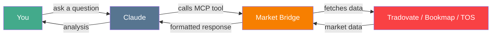
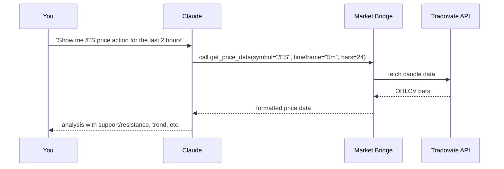
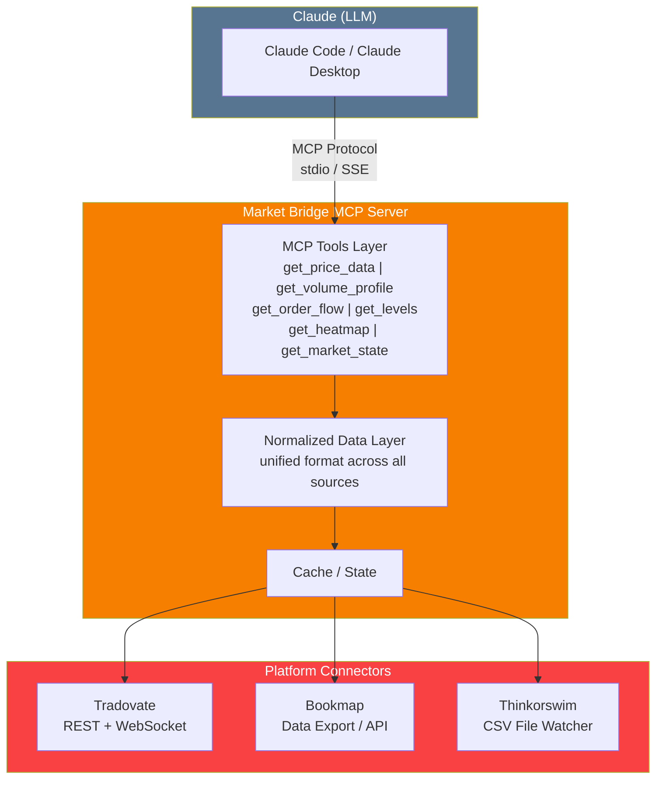
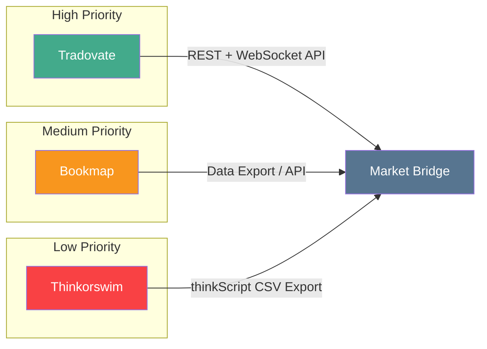
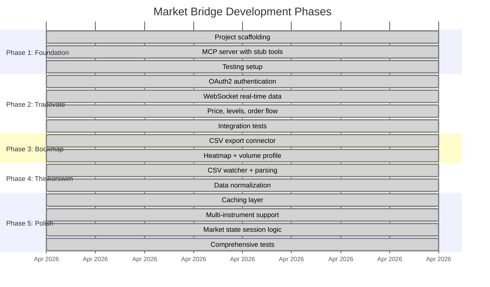

# Market Bridge

An MCP (Model Context Protocol) server that bridges trading platforms to Claude, enabling real-time /ES (S&P 500 E-mini futures) data analysis during conversations.

[](https://www.python.org/downloads/)
[](LICENSE)
[](https://gofastmcp.com)

---

## Table of Contents

- [The Problem](#the-problem)
- [The Solution](#the-solution)
- [How It Works](#how-it-works)
- [Features](#features)
- [Architecture](#architecture)
- [Prerequisites](#prerequisites)
- [Installation](#installation)
- [Configuration](#configuration)
  - [Claude Code](#using-with-claude-code)
  - [Claude Desktop](#using-with-claude-desktop)
- [Usage](#usage)
- [Supported Platforms](#supported-platforms)
- [Project Structure](#project-structure)
- [Development](#development)
- [Roadmap](#roadmap)
- [Contributing](#contributing)
- [FAQ](#faq)
- [License](#license)

---

## The Problem

If you trade futures — especially /ES (the S&P 500 E-mini) — you probably use platforms like **Tradovate**, **Bookmap**, or **Thinkorswim (TOS)** to watch price action, volume profiles, and order flow. These platforms are powerful, but they live in their own world. They can't talk to AI assistants like Claude.

Today, if you want Claude to help you analyze your trading data, you have to:

1. Open your trading platform
2. Manually export data to a CSV file
3. Upload that CSV to Claude
4. Wait for Claude to parse and analyze it
5. Repeat every time you want fresh data

This is slow, tedious, and completely disconnected from real-time market action. By the time you export, upload, and get an answer, the market has already moved.

**There is no plugin, API handshake, or socket connection between Claude and any trading platform.** Claude cannot see your charts. Claude cannot read your order flow. Claude is blind to the market — unless you manually feed it data every single time.


This workflow is broken. Traders need fast answers. Markets don't wait for CSV exports.

---

## The Solution

**Market Bridge** is a small program that runs on your computer and acts as a bridge between your trading platforms and Claude. It uses a protocol called **MCP (Model Context Protocol)** — a standard created by Anthropic that lets Claude call external tools during a conversation, just like a human would open an app to look something up.

Once Market Bridge is running, Claude can **directly ask for market data** — price candles, volume profiles, order flow, support/resistance levels — without you lifting a finger. No CSV exports. No file uploads. Just ask Claude a question about /ES and it fetches the data itself.



**Example conversation once Market Bridge is set up:**

> **You:** "What are the key /ES levels for today's session?"
>
> **Claude:** *\[calls get_levels tool via Market Bridge\]*
> "Here are today's /ES levels based on the current RTH session:
> - **POC** (Point of Control): 5,425.50
> - **VAH** (Value Area High): 5,438.75
> - **VAL** (Value Area Low): 5,411.25
> - **Session High**: 5,442.00
> - **Session Low**: 5,408.50
>
> The POC is near yesterday's close, suggesting balanced trade so far..."

No exports. No uploads. Claude just knows.

---

## How It Works

If you're new to MCP, here's the simple version:

**MCP (Model Context Protocol)** is like giving Claude a set of tools it can use. Think of it like apps on a phone — your phone can't take photos without the Camera app, and Claude can't fetch market data without a tool that knows how.

Market Bridge **is** that tool. It's a small server that runs on your computer. When Claude needs market data, it calls Market Bridge through MCP, and Market Bridge goes and gets the data from your trading platform's API.



**Key concepts:**

| Term | What it means |
|------|--------------|
| **MCP** | A protocol (set of rules) that lets Claude use external tools — like Market Bridge |
| **MCP Server** | A program that provides tools to Claude (Market Bridge is an MCP server) |
| **Tool** | A specific action Claude can take, like `get_price_data` or `get_levels` |
| **Transport** | How Claude talks to the MCP server — either `stdio` (local) or `SSE` (network) |
| **FastMCP** | The Python framework used to build Market Bridge |

---

## Features

Market Bridge exposes six tools that Claude can call at any time during a conversation:

| Tool | Description | Example Question |
|------|-------------|-----------------|
| `get_price_data` | OHLCV candles at any timeframe (1m to 1d) | "Show me /ES 15-min candles for the last 4 hours" |
| `get_volume_profile` | Volume-at-price distribution for a session | "What does today's /ES volume profile look like?" |
| `get_order_flow` | Delta and cumulative delta data | "Is /ES order flow bullish or bearish right now?" |
| `get_levels` | POC, VAH, VAL, high/low volume nodes | "Where are the key /ES levels for this session?" |
| `get_heatmap` | Bid/ask liquidity depth from Bookmap | "Where is the big resting liquidity in /ES?" |
| `get_market_state` | Session info (RTH vs globex, open/close times) | "Is the /ES market open right now?" |

---

## Architecture



**Data flow explained:**

1. Claude sends a tool call (e.g., `get_price_data`) through the MCP protocol
2. The **Tools Layer** validates the request and routes it to the right connector
3. The **Normalized Data Layer** ensures all data looks the same regardless of which platform it came from
4. The **Cache** stores recent data to avoid hammering the APIs
5. The appropriate **Connector** fetches fresh data from the trading platform when needed

---

## Prerequisites

Before you begin, you need to install a few things on your computer. Follow each step carefully.

### 1. Python 3.11 or newer

Market Bridge is written in Python. You need Python version 3.11 or higher.

**Check if you already have it:**

```bash
python3 --version
```

If this prints `Python 3.11.x` or higher, you're good. If not:

- **macOS:** Install via [Homebrew](https://brew.sh) — `brew install python@3.12`
- **Windows:** Download from [python.org](https://www.python.org/downloads/) — check "Add Python to PATH" during install
- **Linux:** `sudo apt install python3.12` (Ubuntu/Debian) or `sudo dnf install python3.12` (Fedora)

### 2. uv (Python package manager)

[uv](https://docs.astral.sh/uv/) is a fast Python package manager. It replaces `pip` and `venv`.

**Install uv:**

```bash
# macOS / Linux
curl -LsSf https://astral.sh/uv/install.sh | sh

# macOS via Homebrew
brew install uv

# Windows
powershell -ExecutionPolicy ByPass -c "irm https://astral.sh/uv/install.ps1 | iex"
```

**Verify it works:**

```bash
uv --version
```

### 3. Git

You need Git to download the project.

**Check if you already have it:**

```bash
git --version
```

If not:

- **macOS:** `xcode-select --install` (or `brew install git`)
- **Windows:** Download from [git-scm.com](https://git-scm.com/downloads)
- **Linux:** `sudo apt install git`

### 4. Claude Code and/or Claude Desktop

You need at least one of these to use Market Bridge:

- **[Claude Code](https://docs.anthropic.com/en/docs/claude-code/overview)** — CLI tool for developers. Install with `npm install -g @anthropic-ai/claude-code`
- **[Claude Desktop](https://claude.ai/download)** — the desktop app for macOS or Windows

---

## Installation

### Step 1: Clone the repository

Open a terminal (Terminal on Mac, Command Prompt or PowerShell on Windows) and run:

```bash
git clone https://github.com/ocrosby/market-bridge.git
cd market-bridge
```

This downloads the project to your computer and moves you into the project folder.

### Step 2: Install dependencies

```bash
uv sync
```

This creates a virtual environment and installs all required Python packages. You should see output ending with something like `Installed XX packages`.

### Step 3: Verify the installation

```bash
uv run pytest tests/ -v
```

You should see all tests passing:

```
tests/test_server.py::test_list_tools PASSED
tests/test_server.py::test_get_price_data_returns_stub PASSED
tests/test_server.py::test_get_market_state_returns_stub PASSED

============================== 3 passed ===============================
```

If all tests pass, Market Bridge is installed correctly.

---

## Configuration

### Using with Claude Code

Claude Code is a command-line tool for developers. Here's how to connect Market Bridge to it.

#### Option A: Project-level configuration (recommended)

This sets up Market Bridge for the current project only. From inside the `market-bridge` directory, run:

```bash
claude mcp add market-bridge -- uv run --directory /FULL/PATH/TO/market-bridge market-bridge
```

Replace `/FULL/PATH/TO/market-bridge` with the actual path to where you cloned the repo. For example:

```bash
claude mcp add market-bridge -- uv run --directory /Users/yourname/market-bridge market-bridge
```

> **How to find the full path:** In your terminal, make sure you're inside the `market-bridge` folder, then run `pwd`. Copy the output — that's your full path.

#### Option B: Global configuration (available in all projects)

If you want Market Bridge available in **every** Claude Code session:

```bash
claude mcp add --scope user market-bridge -- uv run --directory /FULL/PATH/TO/market-bridge market-bridge
```

#### Verify it's registered

```bash
claude mcp list
```

You should see `market-bridge` in the output. Then start Claude Code:

```bash
claude
```

Ask Claude: *"What tools do you have available?"* — it should list the Market Bridge tools.

---

### Using with Claude Desktop

Claude Desktop uses a JSON configuration file to know about MCP servers.

#### Step 1: Find your configuration file

- **macOS:** `~/Library/Application Support/Claude/claude_desktop_config.json`
- **Windows:** `%APPDATA%\Claude\claude_desktop_config.json`

If the file doesn't exist yet, create it.

#### Step 2: Add Market Bridge to the configuration

Open the file in any text editor and add (or merge into) the following:

```json
{
  "mcpServers": {
    "market-bridge": {
      "command": "uv",
      "args": [
        "run",
        "--directory", "/FULL/PATH/TO/market-bridge",
        "market-bridge"
      ]
    }
  }
}
```

Replace `/FULL/PATH/TO/market-bridge` with the actual path where you cloned the repo.

**macOS example:**

```json
{
  "mcpServers": {
    "market-bridge": {
      "command": "uv",
      "args": [
        "run",
        "--directory", "/Users/yourname/market-bridge",
        "market-bridge"
      ]
    }
  }
}
```

**Windows example:**

```json
{
  "mcpServers": {
    "market-bridge": {
      "command": "uv",
      "args": [
        "run",
        "--directory", "C:\\Users\\yourname\\market-bridge",
        "market-bridge"
      ]
    }
  }
}
```

#### Step 3: Restart Claude Desktop

Close and reopen Claude Desktop. The Market Bridge tools should now be available.

#### Step 4: Verify

Start a new conversation in Claude Desktop and ask: *"What MCP tools do you have?"*

Claude should mention the Market Bridge tools (get_price_data, get_levels, etc.).

---

## Usage

Once Market Bridge is configured, just talk to Claude naturally. Here are some example prompts:

### Price data

> "Pull up the last 50 bars of /ES on the 15-minute chart"

> "Show me /ES daily candles for the past week"

### Volume profile

> "What does the /ES volume profile look like for today's RTH session?"

> "Show me the volume profile for the last 3 days"

### Order flow

> "What's the /ES cumulative delta looking like on the 5-minute?"

> "Is order flow confirming this /ES move higher?"

### Key levels

> "What are the important /ES levels for today?"

> "Where's the POC and value area for the current session?"

### Heatmap / liquidity

> "Where is the big resting liquidity in /ES right now?"

### Market state

> "Is the /ES market in RTH or globex right now?"

> "When does the /ES regular session open?"

---

## Supported Platforms



| Platform | Connection Method | Status | Notes |
|----------|------------------|--------|-------|
| **Tradovate** | REST API + WebSocket API | Implemented | Primary data source. OAuth2 auth, WebSocket with reconnection, OHLCV bars, DOM, order flow delta. |
| **Bookmap** | CSV export | Implemented | Parses heatmap and volume profile CSVs from Bookmap's "Export Heatmap Data" feature. |
| **Thinkorswim** | thinkScript CSV export | Implemented | File-based connector with caching. Parses TOS study CSVs (comma and tab delimited). |

---

## Project Structure

```
market-bridge/
├── README.md                              # This file
├── LICENSE                                # MIT license
├── pyproject.toml                         # Project metadata and dependencies
├── .gitignore                             # Files excluded from git
├── .env.example                           # Sample environment variables
├── .python-version                        # Python version pin
├── src/
│   └── market_bridge/
│       ├── __init__.py
│       ├── server.py                      # FastMCP server entry point
│       ├── config.py                      # Settings from env vars / .env
│       ├── cache.py                       # TTL-based data cache
│       ├── models.py                      # Shared data models
│       ├── tools/                         # MCP tool definitions
│       │   ├── __init__.py
│       │   ├── price.py                   # get_price_data
│       │   ├── volume.py                  # get_volume_profile
│       │   ├── order_flow.py              # get_order_flow
│       │   ├── levels.py                  # get_levels
│       │   ├── heatmap.py                 # get_heatmap
│       │   └── market_state.py            # get_market_state
│       └── connectors/                    # Platform-specific API clients
│           ├── __init__.py
│           ├── tradovate.py               # Tradovate REST + WebSocket
│           ├── bookmap.py                 # Bookmap data connector
│           └── thinkorswim.py             # TOS CSV file watcher
└── tests/
    ├── __init__.py
    ├── test_cache.py                      # TTL cache tests
    ├── test_config.py                     # Configuration tests
    ├── test_connectors.py                 # Bookmap + TOS connector tests
    ├── test_market_state.py               # Session logic tests (RTH, globex, weekends)
    ├── test_models.py                     # Data model serialization tests
    └── test_server.py                     # MCP tool registration and call tests
```

---

## Development

### Setting up for development

```bash
git clone https://github.com/ocrosby/market-bridge.git
cd market-bridge
uv sync
```

### Running tests

```bash
uv run pytest tests/ -v
```

### Running the server manually

```bash
# stdio transport (default — used by Claude Code and Claude Desktop)
uv run market-bridge

# SSE transport (for network access / remote clients)
uv run fastmcp run src/market_bridge/server.py --transport sse --port 8000
```

### Inspecting available tools

You can use the FastMCP CLI to inspect what tools the server exposes:

```bash
uv run fastmcp dev src/market_bridge/server.py
```

This opens an interactive inspector in your browser where you can see and test all tools.

### Adding a new tool

1. Create a new file in `src/market_bridge/tools/` (e.g., `my_tool.py`)
2. Define a registration function:

```python
from fastmcp import FastMCP

def register_my_tools(mcp: FastMCP) -> None:
    @mcp.tool
    def my_new_tool(symbol: str = "/ES") -> dict:
        """Description of what this tool does.

        Args:
            symbol: Futures symbol (e.g. /ES, /NQ, /CL)
        """
        return {"symbol": symbol, "data": "..."}
```

3. Register it in `src/market_bridge/server.py`:

```python
from market_bridge.tools.my_tool import register_my_tools
register_my_tools(mcp)
```

4. Add tests in `tests/`

---

## Roadmap



### Phase 1: Foundation (complete)
- [x] Choose runtime and MCP SDK (Python + FastMCP)
- [x] Scaffold MCP server with stdio transport
- [x] Set up project structure, linting, and testing
- [x] Implement all six tool stubs
- [x] Register server in Claude Code MCP config for local development

### Phase 2: Tradovate Integration (complete)
- [x] Implement Tradovate OAuth2 authentication flow with token renewal
- [x] Connect to Tradovate WebSocket API for real-time /ES data
- [x] Implement `get_price_data` tool (OHLCV at multiple timeframes)
- [x] Implement `get_levels` tool (session high/low, POC, value area)
- [x] Implement `get_order_flow` tool (delta, cumulative delta)
- [x] Add reconnection logic with exponential backoff for WebSocket drops
- [x] Contract resolution (auto-resolve /ES to front-month contract)
- [x] RTH/globex session filtering for level calculations
- [x] 36 unit tests covering auth, contract resolution, bars, DOM, order flow, levels, session filtering, and helpers

> **Note:** Order flow delta is approximated from OHLCV bar data, not true tick-level data. The WebSocket infrastructure supports tick streaming but is not yet connected to a live tick feed. True tick-level delta would require a streaming subscription, which is planned for a future release.

### Phase 3: Bookmap Integration (complete)
- [x] Research Bookmap API — no public REST API; CSV export is the path
- [x] Implement `get_heatmap` tool from Bookmap heatmap CSV exports
- [x] Implement `get_volume_profile` tool from Bookmap volume CSV exports
- [x] Handle Bookmap data format parsing with flexible column matching

### Phase 4: Thinkorswim Integration (complete)
- [x] Build CSV parser for TOS thinkScript exports (comma + tab delimited)
- [x] Parse and normalize TOS study data with multiple date format support
- [x] File-level caching to avoid re-parsing unchanged CSVs
- [x] Expose TOS data through existing MCP tools as a fallback source

### Phase 5: Analysis and Polish (complete)
- [x] Implement `get_market_state` tool with full session logic (RTH, globex, weekends, daily maintenance)
- [x] Add TTL-based caching layer with configurable TTL and max entries
- [x] Support multiple instruments (/ES, /NQ, /YM, /RTY, /CL, /GC, and more)
- [x] Configuration via environment variables and `.env` file
- [x] 88 comprehensive tests covering all modules

---

## Contributing

Contributions are welcome! Here's how to get started:

1. **Fork** the repository on GitHub
2. **Clone** your fork locally:
   ```bash
   git clone https://github.com/YOUR_USERNAME/market-bridge.git
   cd market-bridge
   ```
3. **Create a branch** for your feature or fix:
   ```bash
   git checkout -b feat/my-feature
   ```
4. **Install dependencies:**
   ```bash
   uv sync
   ```
5. **Make your changes** and add tests
6. **Run the tests** to make sure everything passes:
   ```bash
   uv run pytest tests/ -v
   ```
7. **Commit** using [Conventional Commits](https://www.conventionalcommits.org/):
   ```bash
   git commit -m "feat: add support for /NQ instrument"
   ```
8. **Push** and open a **Pull Request**

### Commit message format

This project follows [Conventional Commits](https://www.conventionalcommits.org/) with Angular types:

- `feat:` — new feature
- `fix:` — bug fix
- `docs:` — documentation changes
- `test:` — adding or updating tests
- `refactor:` — code restructuring without behavior changes
- `chore:` — maintenance tasks

---

## FAQ

### Do I need a Tradovate / Bookmap / TOS account?

Yes, to get real market data. Without credentials, the tools will still respond (they won't crash) but will return empty results with a message explaining which environment variables to set. This means you can verify the MCP integration works even without an account — you just won't see real data until you configure a data source.

### Does this execute trades?

**No.** Market Bridge is read-only. It only fetches market data for analysis. It cannot place, modify, or cancel orders.

### Is my trading data sent to Anthropic?

Market Bridge runs **locally on your computer**. Data flows from your trading platform through Market Bridge to Claude on your machine. However, your conversations with Claude (including the market data Claude receives through MCP tools) are subject to [Anthropic's usage policies](https://www.anthropic.com/legal/usage-policy) and data handling practices, just like any other Claude conversation.

### Can I use this with instruments other than /ES?

The tools accept a `symbol` parameter, so the interface already supports any futures symbol (e.g., `/NQ`, `/CL`, `/GC`). Actual support depends on which instruments are available through the connected platform's API.

### What's the difference between Claude Code and Claude Desktop?

- **Claude Code** is a terminal-based (CLI) tool for developers. You type commands and chat with Claude in your terminal.
- **Claude Desktop** is a graphical app (like a regular macOS or Windows application) with a chat interface.

Both support MCP servers. You can use Market Bridge with either one — or both.

### Can I run this on a server / in the cloud?

Yes. You can use SSE transport instead of stdio to run Market Bridge as a network service. See the [Development](#development) section for details. This is an advanced configuration.

---

## License

This project is licensed under the MIT License. See the [LICENSE](LICENSE) file for details.
